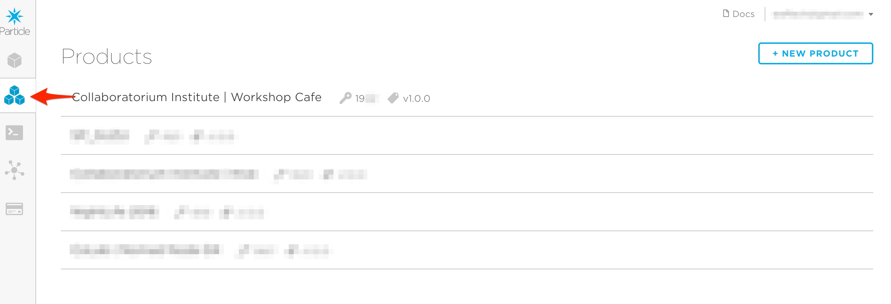
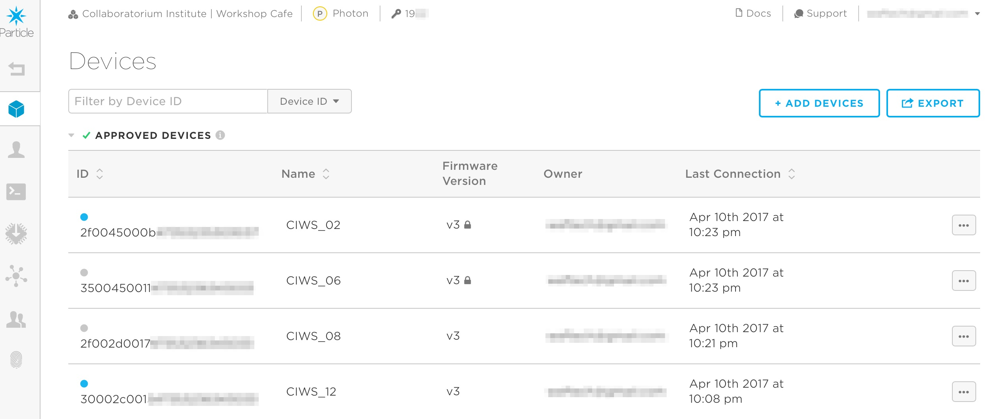

# Workshop Cafe Table Light Documentation

## Index
- [Overview and Purpose](https://github.com/CRB404/Workshop_Cafe_Table_Lights#overview-and-purpose)
- [Components](https://github.com/CRB404/Workshop_Cafe_Table_Lights#components)
- [Hardware Breakdown](https://github.com/CRB404/Workshop_Cafe_Table_Lights#hardware-breakdown)
- [Hardware Assembly](https://github.com/CRB404/Workshop_Cafe_Table_Lights#hardware-assembly)
- [Installation](https://github.com/CRB404/Workshop_Cafe_Table_Lights#installation)
- [Particle Usage and Managment](https://github.com/CRB404/Workshop_Cafe_Table_Lights#particle-usage-and-managment)
- [Particle Code](https://github.com/CRB404/Workshop_Cafe_Table_Lights#particle-code)
- [Troubleshooting](https://github.com/CRB404/Workshop_Cafe_Table_Lights#troubleshooting)

## Overview and Purpose
This is a repository of information regarding the assembly and installation of custom lights and their controller purpose built for the Workshop Cafe. You can find reference material and links for ordering all components as well as detailed instructions on how to reproduce light pucks and control boards. Also included is a guide to installation and how to manage the particle account associated with the control boards. The last section of the documentation contains commented code and suggestions on changes that might be useful for future teams as well as general system troubleshooting notes.

If a question surfaces that this document does not answer, please feel free to email me questions at hello@adamlukasik.com.

## Components
The following is a list of all related componets and links where to purchase them. (as of march 2017)

- [Particle Photon Board](https://store.particle.io/#photon)
- [NeoPixel Jewel](https://www.adafruit.com/product/2226)
- [8 Pin Ethernet Connectors](http://www.jameco.com/webapp/wcs/stores/servlet/ProductDisplay?refineValue=8&refineType=1&langId=-1&position=1&productId=2078258&refine=1&catalogId=10001&history=2ng9d8k9%7CsubCategoryName~Interconnects%5Erdtvalue~Interconnects%5Erdttype~c%5Ecategory~30%5EcategoryName~category_root%5EprodPage~15%5Epage~SEARCH%252BNAV%40y84g320r%7Ccategory~3038%5EcategoryName~cat_30%5Eposition~1%5Erefine~1%5EsubCategoryName~Interconnects%2B%252F%2BNetworking%252FTelecom%5EprodPage~15%5Epage~SEARCH%252BNAV&sub_attr_name=Number+of+Contacts&storeId=10001&ddkey=http:StoreCatalogDrillDownView)
- [Cat 5e Ethernet Cables](http://www.jameco.com/shop/StoreCatalogDrillDownView?langId=-1&storeId=10001&catalogId=10001&refine=1&position=1&category=254556&subCategoryName=Wire%20%26amp%3B%20Cable%20%2F%20Network%20Cables%20%2F%20Cat%205e%20Ethernet&categoryName=cat_2545&history=geq9fp7f%7CfreeText~ethernet%2Bnetworking%5Esearch_type~jamecoall%5EprodPage~15%5Epage~SEARCH%252BNAV%403yeaqqf8%7Ccategory~2545%5EcategoryName~cat_25%5Eposition~1%5Erefine~1%5EsubCategoryName~Wire%2B%2526%2BCable%2B%252F%2BNetwork%2BCables%5EprodPage~15%5Epage~SEARCH%252BNAV)
- [Board Headers](http://www.jameco.com/z/G85-20-R-Header-Vertical-Receptacle-1-Row-20Cont-100-2-54mm-Female-Header-Receptacle_308567.html)
- [Board Through Hole Headers](http://www.jameco.com/z/7000-1X20SG-R-Connector-Unshrouded-Header-20-Position-2-54mm-Solder-Straight-Thru-Hole_103369.html)
- [Power Supply](http://www.jameco.com/z/RS-50-5-Mean-Well-AC-to-DC-Power-Supply-Single-Output-5-Volt-10-Amp-50-Watt_323388.html)
- [Screw Terminal](http://www.jameco.com/z/OSTTA024163-On-Shore-Technology-2-Position-Top-Screw-Terminal-Block_152347.html)
- [Varied Color Wire](http://www.jameco.com/z/HUWBUN100FT6-22-AWG-6-Color-Solid-Tinned-Copper-Hook-Up-Wire-Assortment-100-Feet_2159189.html)
- [Enclousure](https://www.polycase.com/xr-57f)
- [Heat Shrink](http://www.jameco.com/webapp/wcs/stores/servlet/ProductDisplay?refineValue=1%26amp%3Bquot%3B&refineType=1&langId=-1&position=1&productId=2113682&refine=1&catalogId=10001&history=ylltrh3k%7CfreeText~heat%2Bshrink%2Btubing%5Esearch_type~jamecoall%5EprodPage~50%5Epage~SEARCH%252BNAV&sub_attr_name=Product+Diameter&storeId=10001&ddkey=http:StoreCatalogDrillDownView)
- [Acrylic Disks](http://www.tapplastics.com/product/plastics/plastic_rods_tubes_shapes/cast_acrylic_discs/137)
- [PCB Manufacturing Service]()
- [PCB File]()

To any further editor of this document, please try to keep these links upto date.

## Hardware Breakdown
The hardware is broken down into two primary pieces. The first are the boards. A single board consists of a particle photon, a 5 volt 10 amp powersupply, a custom PCB (file inlcuded in repo), a screw terminal, a group of headers and 8 female ethernet ports.

The second are the light pucks. A single puck is made using a Neopixel Jewel which is a circular configuration of 7 RGB Neopixel LEDs along with multi color wire and a female ethernet port. The puck also requires a 1 inch diameter acrylic circle, .25 inch thick, and an ethernet cable at the apropriate length from the puck to the control board. The entire puck minus the ethernet cable must also be encased in heat shrink.

The different pieces are made to be as modular as possible and are made to be easily incoperated into table tops or housings such as the ones used in the first installation at the Workshop Cafe. The modularity is ideal for changing spaces and replacement of parts that might break or ware down.

## Hardware Assembly

Hardware assembly happens in two stages, one stage for the puck, another for the boards. Above are all the necessary electronic parts.

### Puck Assembly

In order to assemble a light puck it is important to cut 3 short lengths of different color wire about 3 inches long and strip the ends so the wire inside is exposed.

You will need:
- 3 different colored wires with both ends stripped
- 1 NeoPixel
- 1 ethernet connector
- about 3 inches of 1inch heat shrink
- 1 sanded acrylic 1 inch disk
- 1 ethernet cat 5e cable of appropriate length (measure the rough distance from the puck to the control board)
- soldering iron
- wire snips
- wire strippers
- hot glue gun
- heat gun

Fist [solder](https://www.youtube.com/watch?v=oqV2xU1fee8) the three different colored wires onto the NeoPixel and ethernet conector. In the diagram below I use a dark blue wire for ground, a light blue and white wire for power or voltage (this apears on the NeoPixel as 5v) and an orange wire for data. These colors reflect the colors used in our initial build so feel free to use any color you like just make sure they are consistant across all the pucks you make.

First start by soldering to the NeoPixel, the holes are also printed onto the front and back of the component. After that take the ethernet connector and clip off the center 5 pins leaving the two on the left and the one on the right intact as displayed in the diagram. Make sure you are looking at the connector so that the pins are facing up and the port is facing away from you. Then solder the data pin to the far right pin. Next solder that ground wire to the far left pin. Lastly solder the power (5v) pin to the center left pin.

Make sure to check every puck you made to ensure the solder is strong and you have atached the correct pin to the correct wire. This step is where most errors occur so **take your time**. To test solder strength lightly tug on the wire while holding the component, if it is weak it will break. Don't worry if that happens simply try again.

Finally, hot glue the acrylic disk to the front face of the NeoPixel. Make sure to only use a small dab of hot glue, you barely need any and **too much heat will damage the lights**. Lastly slip the heatshrink over the whole part so that the acrylic fills one end and the ethernet connection is exposed on the other. Use the heat gun to slowly shrink the tubbing around your new light part.

### Board Assembly

In order to assemble a control board you will need to have some practice [soldering](https://www.youtube.com/watch?v=oqV2xU1fee8). This important becuase a poor solder joint on the board will create issues that will be hard to troubleshoot. Make sure to practice at it if you are new to electronics.

You will need:
- 1 Printed Control Board or PCB for short
- 1 Particle Photon
- 8 ethernet connectors
- power supply and power cable, provided with supply
- 2 wires with ends stripped, I recomend black and red
- soldering iron
- wire snips
- wire strippers
- hot glue gun (optional)
- small screwdriver

The first step is to solder the 8 ethernet ports to the board. There may seem like a lot of holes but acutally this step is very easy. Simply take each ethernet conector and place it with the pins up and the port facing away from you, now **ben the far right pin down away from the other pins** like in the diagram below. Next place all the connectors in their places along the edge of the board. The pin that was bent back will be very obviously ontop of an extrahole that is elongated. Solder that pin the the hole it is sitting on as in the diagram.

Next turn the board over and solder the far left two pins of each connector to the board, you can ignore the rest.

Now get your particle photon and any headers you might need, here we are showing you a photon that requires you to solder headers onto it but they can be purcahsed with headers already attached. You will need female headers for your control board though.

Next place your headers onto the boards and solder them into place, you will likely need to cut your headers down to size with the snips. **Make sure you have counted and cut correctly or there may be unforseen issues**.

After you have your boards soldered together, place the photon onto the headers. All that is left is to connect the board to power. Take the power supply and connect the power cord as shown in the image below, black to the L port, white to the N port, and green to the ground port, that's the port with the lines and no letters. These ports are screw terminals so you will need to unscrew them with your screwdriver and then place the wires in the space now open. Then you clamp the wire down by tightening the screw as tight as possible.

Next take your red and black wires and connect them to the power supply. The black connects to -V and the red to +V. Feel free to coat the wire connections with hot glue. This makes them much more secure and lowers the risk of them pulling out. **Be sure you connected everything correctly first though or else you wasted a power supply**.

Lastly you wil need to solder the small screw terminal onto the control board.

Then simply use your screw driver to connect the red wire to the left port and the black wire to the right port.

Your control board is done and can be connected to the pucks and flashed with the correct code. How to flash code is covered in [Particle Usage and Managment](https://github.com/CRB404/Workshop_Cafe_Table_Lights#particle-usage-and-managment).

## Installation

Installation begins with collecting all necessary parts. In order to install 8 lights you wil need:
- 1 control board
- 8 light pucks
- 1 particle photon
- 1 power supply
- 8 lengths of ethernet wire that are close to the exact distance between puck and control board
- 1 component enclosure
- 4 metal light enclosures

Begin by making sure your photon is correctly plugged into the the control board and the power supply is connected via the screw terminals. If this all sounds fuzzy then look [here](https://github.com/CRB404/Workshop_Cafe_Table_Lights#hardware-assembly).

Next set the

## Particle Usage and Managment

## Particle Code
The code we created to run on each particle is compleately uniform. Every board is flashed with the same logic. You can find the code [here]().

The code controls the color and animation behavior of each of the 8 connected NeoPixel pucks. The main functional section of the code is contained in the function ***TableNote***. The code is formated to be workable in a C++ enviroment such as the one for Arduino and the Particle Photon. ***TableNote*** contains a switch function that relates to an array of known commands. Every Photon board has these commands programmed into the array.

`String cmd[] = {"green1", "pulse1", "white1", "green2", "pulse2", "white2", "green3", "pulse3", "white3", "green4", "pulse4", "white4", "green5", "pulse5", "white5", "green6", "pulse6", "white6", "green7", "pulse7", "white7", "green8", "pulse8", "white8", "off1", "off2", "off3", "off4", "off5", "off6", "off7", "off8"};`

The switch statement then runs through 31 cases, each relating to the array position of the command. The following is a break down of all the command logic for ***seat 1***. The logic repeats for each puck.

### Occupied (case 0)

    // set light to occupied
    case 0: // case 0 corellates to "green1"
      if (stateController[0] == 1) { // check state
        for (int i = 0; i < strip0.numPixels(); i++) { // update color to the leds
          strip0.setPixelColor(i, 0, 255, 0); strip0.setBrightness(20); strip0.show(); delay(1); // defines new color and brightness
        }
        return 0;
      }

      else if (stateController[0] != 1){ // check state
        stateController[0] = 1; // set state to 1 (occupied)

        for (int i = 0; i < strip0.numPixels(); i++) { // update color to the leds
          strip0.setPixelColor(i, 0, 255, 0); // defines new color
        }

        // animates the light with a pluse using the occupied color
        for (int i = 10; i < 20; i++) { strip0.setBrightness(i); strip0.show(); delay(30); }
        for (int i = 20; i > 10; i--) { strip0.setBrightness(i); strip0.show(); delay(30); }
        for (int i = 10; i < 20; i++) { strip0.setBrightness(i); strip0.show(); delay(30); }
        return 0;
      }

      break;

The first case checks the stateController array, looking for a value of 0. 1 or 2. If the value is set as 1 then it populates the puck with green light. If the stateController array is any other value then it sets the controller value to 1 and animates the light with green.

### Pulse (Case 1)

    // set light to blink and then return to correct state
    case 1: // case 1 corellates to "pulse1"
      for (int i = 0; i < strip0.numPixels(); i++) { // update color to the leds
        strip0.setPixelColor(i, 250, 0, 0); // defines new color
      }

      // animates the light with a long pluse using the pulse color
      for (int i = 10; i < 20; i++) { strip0.setBrightness(i); strip0.show(); delay(30); }
      for (int i = 20; i > 10; i--) { strip0.setBrightness(i); strip0.show(); delay(30); }
      for (int i = 10; i < 20; i++) { strip0.setBrightness(i); strip0.show(); delay(30); }
      for (int i = 20; i > 10; i--) { strip0.setBrightness(i); strip0.show(); delay(30); }
      for (int i = 10; i < 20; i++) { strip0.setBrightness(i); strip0.show(); delay(30); }
      for (int i = 20; i > 10; i--) { strip0.setBrightness(i); strip0.show(); delay(30); }
      for (int i = 10; i < 20; i++) { strip0.setBrightness(i); strip0.show(); delay(30); }
      for (int i = 20; i > 10; i--) { strip0.setBrightness(i); strip0.show(); delay(30); }
      for (int i = 10; i < 20; i++) { strip0.setBrightness(i); strip0.show(); delay(30); }
      for (int i = 20; i > 10; i--) { strip0.setBrightness(i); strip0.show(); delay(30); }
      for (int i = 10; i < 20; i++) { strip0.setBrightness(i); strip0.show(); delay(30); }

      if (stateController[0] == 1) { // check if state is occupied
        for (int i = 0; i < strip0.numPixels(); i++) {
          strip0.setPixelColor(i, 0, 255, 0); strip0.setBrightness(20); strip0.show(); delay(1); // resets color to state color
        }
        return 0;
      }

      else if (stateController[0] == 2){ // check if state is UN occupied
        for (int i = 0; i < strip0.numPixels(); i++) {
          strip0.setPixelColor(i, 255, 255, 255); strip0.setBrightness(20); strip0.show(); delay(1); // resets color to state color
        }
        return 0;
      }

      else if (stateController[0] == 0) { // check if state is off
        for (int i = 0; i < strip0.numPixels(); i++) {
          strip0.setPixelColor(i, 0, 0, 0); strip0.setBrightness(0); strip0.show(); delay(1); // resets color to state color
        }
        return 0;
      }

      break;

The second case animates the puck with red light by pulsing the light. It then checks the stateController array for a value and resets the color to correlate to the corresponding state.

### UN occupied (Case 2)

    // set light to UN occupied
    case 2: // case 2 corellates to "white1"
      if (stateController[0] == 2) { // check state
        for (int i = 0; i < strip0.numPixels(); i++) { // update color to the leds
          strip0.setPixelColor(i, 255, 255, 255); strip0.setBrightness(20); strip0.show(); delay(1); // defines new color and brightness
        }
        return 0;
      }

      else if (stateController[0] != 2){ // check state
        stateController[0] = 2; // set state to 2 (UN occupied)

        for (int i = 0; i < strip0.numPixels(); i++) { // update color to the leds
          strip0.setPixelColor(i, 255, 255, 255); // defines new color
        }

        // animates the light with a pluse using the occupied color
        for (int i = 10; i < 20; i++) { strip0.setBrightness(i); strip0.show(); delay(30); }
        for (int i = 20; i > 10; i--) { strip0.setBrightness(i); strip0.show(); delay(30); }
        for (int i = 10; i < 20; i++) { strip0.setBrightness(i); strip0.show(); delay(30); }
        return 0;
      }

      break;

The third case checks the stateController array, looking for a value of 0. 1 or 2. If the value is set as 2 then it populates the puck with white light. If the stateController array is any other value then it sets the controller value to 2 and animates the light with white.

### Off State (Case 24)

      // off Seat 1
          case 24:
            stateController[0] = 0;
            for (int i = 0; i < strip0.numPixels(); i++) {
              strip0.setPixelColor(i, 0, 0, 0); strip0.setBrightness(0); strip0.show(); delay(1);
            }
            break;

The off state is triggered when the stateController has a value of 0. This then sets the puck color and brightness to 0.

## Particle console

All documentation for the [particle console](https://console.particle.io) and [particle-cli](https://github.com/spark/particle-cli)

To View all of your your particles first login to the particle [console](console.particle.io). Then navigate to the product tab on the left had navigation and then select workshop cafe as the product.

### Using the console

## Troubleshooting

### Puck Color

- If the puck turns green on boot that is normal. Once it receives a command it will update the color.
- If the puck is not turning on try a difference port or try replacing the cable.
- If there is flickering or purple hue with the puck then replace it.

### Wifi Connection Issues

You will need to:
- Get a micro USB Cables
- Small philips and medium flathead screwdriver
- Install [Particle CLI](https://docs.particle.io/guide/tools-and-features/cli/photon/)

Then connect to the device via mirco-usb. Then place the device WIFI setup mode by holding down the mode button until it starts flashing blue. Then release the button and press it a second time until the slow pulse changes to a quick pulse. Typically about 20 seconds. Next open a console on you computer (On Macintosh its called Terminal) and install the following command.

Next run the following command and copy the 13 digit serial number.
''particle identify''

Now we can connect to the wifi by running.
''particle serial wifi''

Then we need to add the device to out account.
''particle add device 0000000000000''

Done!
